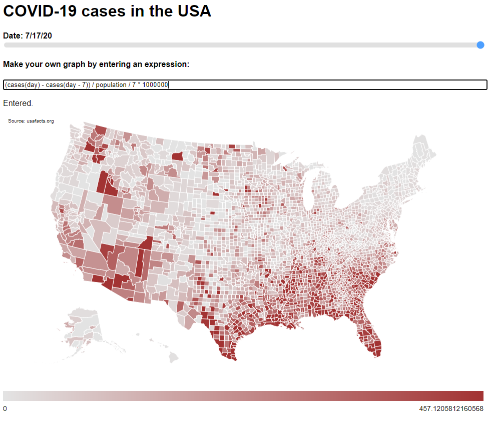

# covid-mapper

Create maps using COVID-19 data.

Code based on: http://bl.ocks.org/TheMapSmith/bd3ef04e33483e671601c753856273cb

Data: https://usafacts.org/visualizations/coronavirus-covid-19-spread-map/

To download and merge data into one CSV:

`cd data`

`python merge_csv.py`

To run (requires installing http-server with npm install -g http-server):

`http-server .`